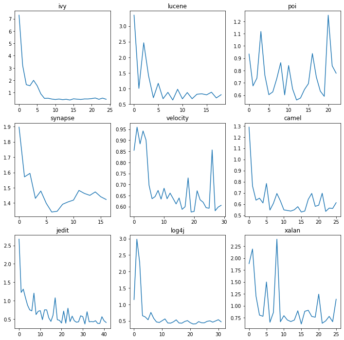

# April 22 - April 29 Progress Report

## Doing

## Done

**ASE paper:**

* Ran defect prediction with DL for 10 epochs and 100 epochs: barely any difference between the two.
* How `roc_auc_score` works: for binary classification, essentially runs the same code as Amrit's AUC calculation, i.e., gets the standard AUC.
* Printed out tp, tn, fp, fn: [TODO: LINK]
* Plotted losses over epochs; early stopping criterion called. Set patience to 10 (3 seemed small, 5 resulted in jagged curve for Jedit).

* **SAIL-ON Questionnaire:**
    * No project fulfils requirements, eliminated by individual checks (ex: we require number of closed issues >= 50, but max number of issues (open + closed) is 44).
* **AI+V&V:**
    * [Case studies from the literature review](https://docs.google.com/spreadsheets/d/1HP-iZXAydyzPd0u28L3JqKDxf68tu9ED3Sp-TBY31Kk/edit?usp=sharing)

## Todo

## Roadblocks

* Time limit for running DODGE on DL in ARC