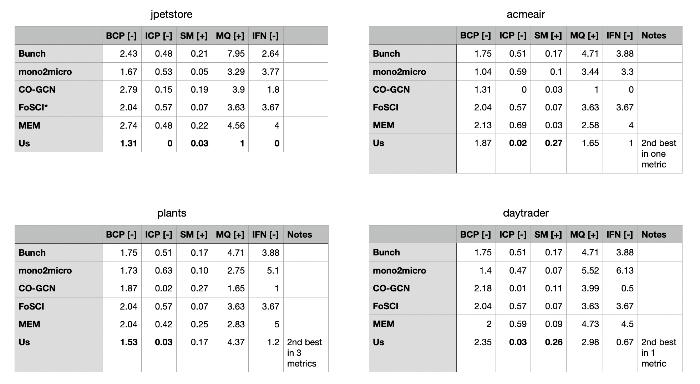

# IBM

## Method

* **Stand of the shoulders of giants.**
    * Start from CO-GCN
* **Learn from the data.**
    * Look at the data to calculate weights for the loss function
* **Build on prior work.**
    * Instead of k-means, use spectral clustering
    * Instead of exponential LR policy, use 1cycle (from DL literature)

# DoR

## Progress

* Did one work packet, reviewed one
* Implemented Kappa statistics
* Discussion with Ben

# Adelaide

## (Lack of) progress

* Haven't heard back yet about preprocessing code
* Running  ~1 week late, will need to reduce scope of paper

