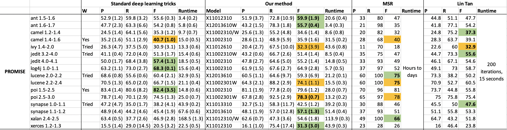

# December 9 - December 16 Summary

[Spreadsheet link](https://drive.google.com/file/d/11cyW2XYFhwIyeZsZfPx_fVFke1ASSp_d/view?usp=sharing)  |  [Raise an issue](https://github.com/raise-yedida/defect-prediction-dnn/issues/new)

* Improved results a bit by using wider neural nets, but more neurons.

    

* We should instead compare (deep learning literature + our method) vs. (MSR + Lin Tan), i.e., standard deep learning stuff vs. SE literature

    

    * Overall Cohen d (with bias correction): 0.35 (medium effect)

    * Overall Cohen d (without bias correction): 0.40 (medium effect)

    * Individual *diff / pooled SD* values:

        

* Started running Cross-Project Defect Prediction (CPDP)

    <table>
      <tr>
        <th>Data</th>
      	<th>Our method</th>
        <th>MSR</th>
        <th>Lin Tan</th>
        <th>TCA+</th>
      </tr>
      <tr>
      	<td>ant 1.6 - camel 1.4</td>
        <td>33.2 (2.4)</td>
        <td>32</td>
        <td>31.6</td>
        <td>29.2</td>
      </tr>
      <tr>
      	<td>jEdit 4.1 - camel 1.4</td>
        <td>32.4 (1.9)</td>
        <td>31</td>
        <td>69.3</td>
        <td>33</td>
      </tr>
      <tr>
      	<td>camel 1.4 - ant 1.6</td>
        <td>57.0 (2.3)</td>
        <td>45</td>
        <td>97.9</td>
        <td>61.1</td>
      </tr>
      <tr>
      	<td>poi 3.0 - ant 1.6</td>
        <td>57.4 (1.9)</td>
        <td>39</td>
        <td>47.8</td>
        <td>59.8</td>
      </tr>
    </table>

    